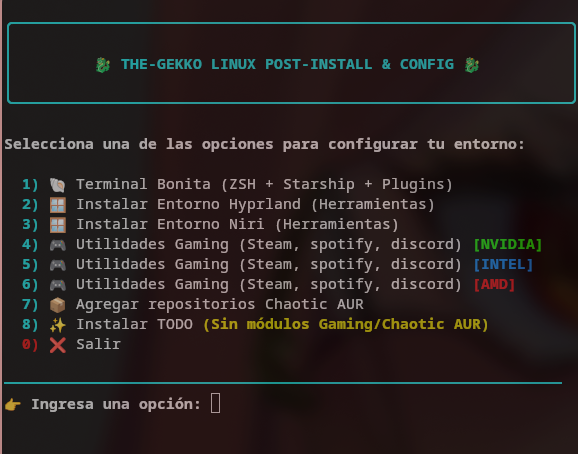

    <h1>The-Gekko | Soluciones Tech</h1>
    

        <strong>Lic. en Gestión y Desarrollo de Tecnología</strong> &bull;
        <strong>Maestría en Diseño Multimedia</strong>
    

    

        <em>"Transformando la lógica en estética, un commit a la vez."</em>
    

### 👤 Sobre mí

Soy un desarrollador con ojo de diseñador. Me especializo en crear experiencias visuales fluidas y sistemas robustos. Mi día a día transcurre entre terminales personalizadas de **Arch Linux**, compilaciones en **Rust** y el diseño de interfaces dinámicas con **QML**.

- 🎓 **Academia:** Cursando mi **Maestría en Diseño Multimedia**, con hambre de seguir aprendiendo al punto de que, al terminar, me iré directo a estudiar un **Doctorado**.
- 🛠 **Actualmente:** Liderando **The-Gekko | Soluciones Tech**.
- 🧪 **Testing:** Colaboro activamente testeando aplicaciones para la comunidad de desarrolladores.
- 🎨 **Pasión:** La personalización extrema de entornos (Dotfiles) y el diseño multimedia.
- 🐢 **Comunidad:** Líder Técnico de "las tortugas de ezku".
- 🎖️ **Comunidad:** Manager de "Helldivers 2 elit latinamerica".

### 🌟 Desempeño y Proyectos Destacados

**[GekkoApp] ** (En constante actualización)  
Mi proyecto insignia desarrollado para facilitar la vida de los entusiastas de Linux. Es una herramienta robusta diseñada para la automatización, instalación y preconfiguración de:

- 🪟 Entornos Tiling modernos como **Hyprland** y **Niri**.
- 🎮 Herramientas de optimización y utilidades **Gaming**.
- 📦 Integración nativa con repositorios **Chaotic AUR**.

<!-- Reemplaza "ruta-a-la-foto.png" con el enlace o la ruta local a la captura de pantalla de tu app -->

    

 

    <h3>🚀 Stack Tecnológico</h3>

#### 💻 Desarrollo

  

#### 🎨 Diseño Multimedia

  

#### 🐧 Sistemas y Entornos

 

<h3>💻 Mi Setup & Entorno</h3>

    <strong>CPU:</strong> Intel i7-13620H |
    <strong>GPU:</strong> NVIDIA GeForce RTX 4050 |
    <strong>OS:</strong> Arch Linux (Main) / Windows (Secondary)

    <h3>📊 GitHub Stats</h3>
    
    
     
    

 

    <h3>¿Tienes un proyecto en mente? Hablemos</h3>
    
    

